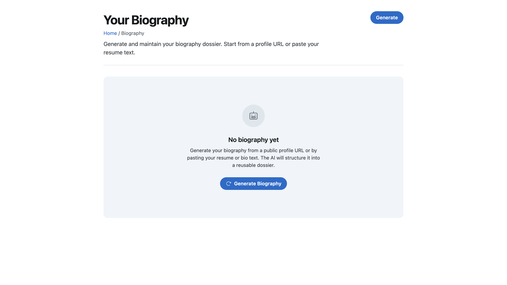
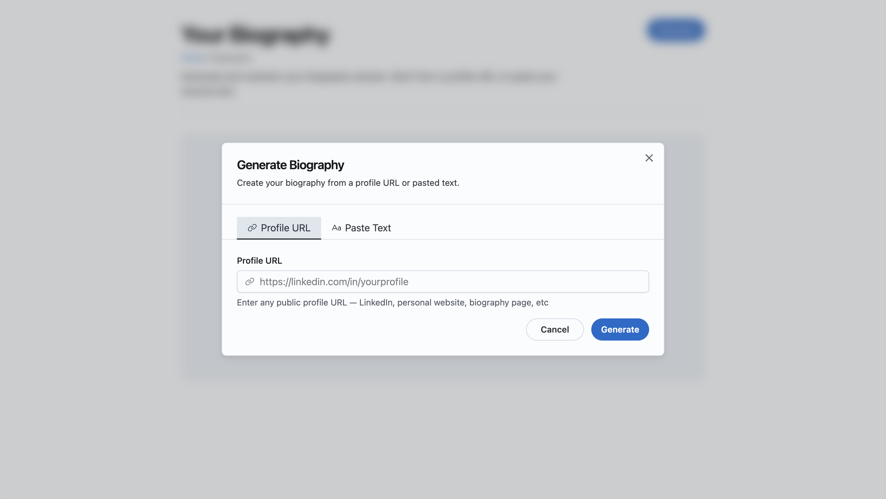
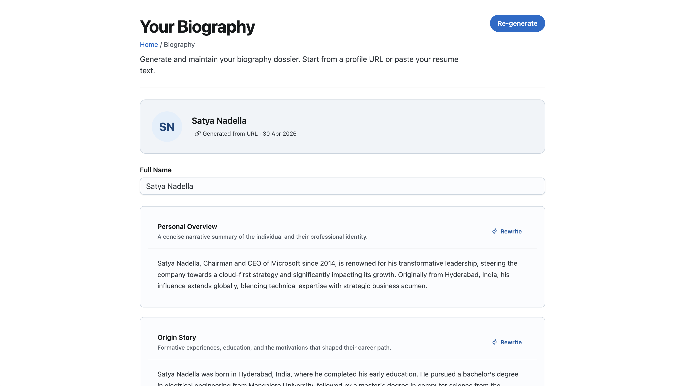
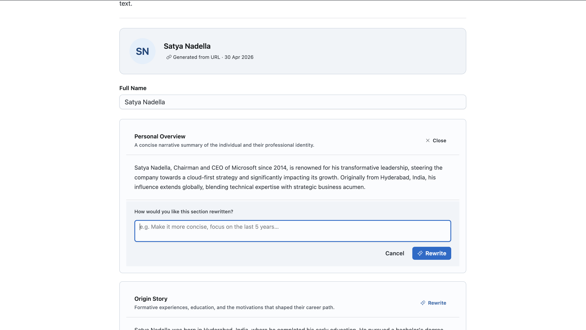
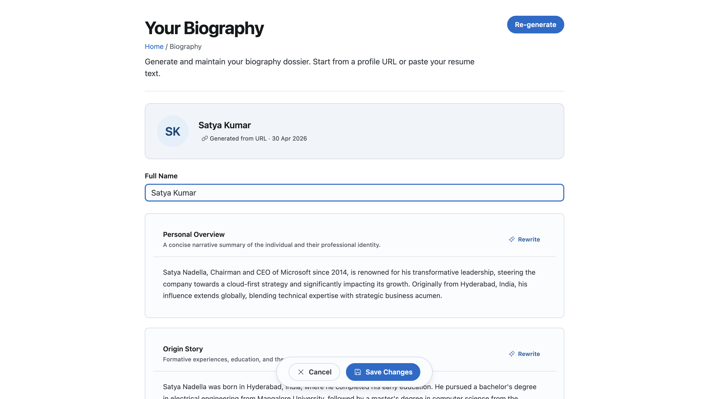

# Baseplate Biography

A full-stack MVP feature I built as part of the Baseplate engineering exercise. It lets a user generate a structured biography dossier from a public profile URL or pasted text, edit it section by section, and rewrite individual sections using AI — all within a single-page experience backed by Supabase and OpenAI.

---

## Try It Live

**Live URL:** https://baseplate-biography.vercel.app/biography

No sign-up needed. The app automatically signs in anonymously so you can exercise the full feature right away.

**Quickest path to test:**
1. Click **Generate**
2. Switch to the **Paste Text** tab
3. Paste any resume or LinkedIn "About" text and click **Generate**
4. Once sections appear, edit any section or click **Rewrite** on a card to give the AI a direction
5. Click **Save Changes** to persist

To test URL mode, use a well-known public figure like `https://www.linkedin.com/in/satyanadella/` — see [LinkedIn limitation](#linkedin-url-mode) below.

---

## Screenshots







---

## What I Built

### Backend

| Component | What it does |
|---|---|
| `biography_profiles` table | User Singleton table with all 9 biography sections, provenance columns, RLS, soft delete, and a partial unique index enforcing one active row per user |
| `biography-generate-profile-from-text` | Supabase Edge Function — takes pasted text, calls GPT-4o with a structured prompt, writes all 9 sections back to the DB |
| `biography-fetch-profile-from-url` | Supabase Edge Function — validates the URL (SSRF prevention), calls Diffbot Enhance API, converts the enriched record to text, then runs the same GPT-4o generation inline |
| `biography-rewrite-section` | Supabase Edge Function — rewrites a single named section based on a user instruction, validates the section key, persists to DB, returns the updated profile |

### Frontend

| Component | What it does |
|---|---|
| `/biography` page | Standard page header (h1, breadcrumbs, description, right-aligned action grid), loading skeleton, empty state, error state, async generation banner, editable section form, Save/Cancel footer |
| `GenerateBiographyModal` | Tabbed modal (Profile URL + Paste Text), single-scroll-owner layout, RHF + Zod validation, form resets on close |
| `BiographySectionCard` | Joy Card per biography section — editable Textarea, inline collapsible AI rewrite panel, loading states, toast feedback |
| Provenance chip | Shows how the profile was generated (URL or text) and when it was last updated |
| Avatar identity banner | Displays initials from the subject name above the section list |

---

## What Is Complete

- [x] Database schema with RLS, soft delete, provenance columns, singleton constraint
- [x] Edge function: generate from pasted text (GPT-4o structured output)
- [x] Edge function: generate from profile URL (Diffbot -> GPT-4o)
- [x] Edge function: rewrite individual section with user instruction
- [x] `/biography` page — empty, loading, error, and populated states
- [x] Generate/Update modal with URL and Paste Text tabs
- [x] Editable sections with Save/Cancel
- [x] Inline AI rewrite panel per section (no page reload, single spinner)
- [x] Provenance indicators (source type chip + last-updated date)
- [x] Anonymous auth for zero-friction reviewer testing
- [x] Deployed to Vercel, edge functions deployed to Supabase

---

## Known Limitations

### LinkedIn URL mode

LinkedIn blocks all live scraping. Diffbot Knowledge Graph only covers well-known public figures.

| Profile type | Result |
|---|---|
| Well-known public figure (e.g. `satyanadella`) | Works |
| Personal / private profile | 422 — not in Diffbot index |

**Workaround:** Use the Paste Text tab and paste the LinkedIn profile text directly from the browser. This works for every profile type, every time. The error message is explicit — not a silent failure.

### Generation timeout

LLM generation runs inline in the edge function (no background job). GPT-4o typically responds in 5–12 seconds. Very long texts could approach Supabase's ~30s edge function timeout.

---

## Assumptions I Made

1. **No full Baseplate platform.** The shared `customers` and `users` tables don't exist in this standalone repo, so I use `auth.uid()` for RLS and write a sentinel `customer_id` UUID to satisfy the NOT NULL constraint. In a real Baseplate host app these resolve via `current_user_id()` and `customer_id()` helper functions.

2. **Inline synchronous generation.** I ran LLM calls directly in the edge function rather than queuing a background job. The UI shows a "Generating…" banner while the call is in flight, which is sufficient for MVP.

3. **No list page.** This is a User Singleton — per the ui.md guide there is no list view. The page loads the user's single profile row automatically.

4. **Rewrites persist immediately.** After a rewrite, Cancel resets to the rewritten state (not the pre-rewrite state), because the DB has already been updated.

5. **Navigation placement.** The spec says User Singleton screens belong under the user avatar dropdown. In this standalone build I navigate directly to `/biography`. A full Baseplate shell would link it from the user menu.

---

## Decisions Where the Spec Was Ambiguous

| Question | What I decided |
|---|---|
| Should `biography-fetch-profile-from-url` call the text generation function as a sibling edge function? | No — I inlined the GPT-4o logic to avoid the latency and complexity of function-to-function networking. The text generation function still exists independently. |
| What is `biography_job_id` when there is no jobs table? | A correlation UUID generated at generation time with no FK constraint. It surfaces as a provenance chip in the UI. |
| What format should "provenance indicators" take? | A Joy `Chip` showing source type and last-updated date. |
| Standard record-keeping columns on a User Singleton — required? | Yes. The spec explicitly lists them, so I included them even though the database guide treats them as optional for singletons. |
| `edgeFunctions.invoke()` wrapper from `@/lib/supabase/edge-functions` | That Baseplate file doesn't exist in this standalone repo. I call `supabase.functions.invoke()` directly. |
| Toast imports from `@/components/core/toaster` | Same situation. I import from `sonner` directly; behavior is identical. |

---

## What I Would Improve With More Time

1. **Async generation with Realtime.** Queue LLM work via a background job and subscribe to Supabase Realtime — no timeout risk, better UX for large inputs.
2. **Version history.** Add a `biography_profile_versions` table so every generation creates an immutable snapshot users can restore.
3. **Source material panel.** Show collapsed source text so users can verify what was used to generate the profile.
4. **Character counter.** Live counter on the paste-text textarea.
5. **E2E tests.** Playwright tests covering the full generation flow.
6. **Explicit `user_id` query filter.** Add `.eq("user_id", baseplateUserId)` alongside the RLS filter to close the system-admin edge case.

---

## How I Used AI

I used GitHub Copilot throughout to move faster on routine implementation work:

- Scaffolding the database migration with Baseplate naming conventions
- Drafting edge function logic and the OpenAI structured-output prompt
- Generating the Diffbot entity-to-text conversion helper
- Building TanStack Query hooks and mutation patterns
- Setting up the RHF + Zod form structures

**Things I caught and fixed in the AI output:**

- **SSRF vulnerability** — the initial URL validation omitted private IP range checks (`10.x`, `172.16-31.x`, `192.168.x`). I added explicit guards.
- **Competing scroll containers** — the AI set `overflow: auto` on both `ModalDialog` and `Textarea`. I corrected this to the single-scroll-owner pattern from `ui.md`.
- **Cancel after rewrite** — the AI used `form.setValue()` which would have made Cancel revert to the pre-rewrite state. I replaced it with `form.resetField()` so Cancel respects the post-rewrite default.
- **Nested form page reload** — the rewrite panel was rendered as `<Box component="form">` nested inside the page's outer `<form>`. HTML ignores nested form boundaries, so clicking Rewrite submitted the page form as a GET request. Fixed by removing `component="form"` entirely and using `type="button"` with an `onClick` handler.
- **Multiple spinners** — the Rewrite button had both `loading={isPending}` (Joy's built-in spinner) and a manual `CircularProgress` in `startDecorator`. Removed the manual decorator; Joy's `loading` prop is the only spinner.

---

## Local Setup

### 1. Clone and install

```bash
git clone <repo>
cd baseplate-biography
npm install
```

### 2. Configure environment variables

```bash
cp .env.example .env.local
```

Fill in `.env.local`:

```
NEXT_PUBLIC_SUPABASE_URL=https://your-project.supabase.co
NEXT_PUBLIC_SUPABASE_ANON_KEY=your-anon-key
OPENAI_API_KEY=sk-...
DIFFBOT_API_KEY=your-diffbot-token
```

### 3. Enable anonymous auth in Supabase

Supabase Dashboard -> Authentication -> Providers -> **Anonymous** -> Enable

### 4. Apply the database migration

```bash
supabase link --project-ref your-project-ref
supabase db push
```

Or paste `supabase/migrations/20240101000002_recreate_biography_profiles_standalone.sql` directly into the Supabase SQL editor.

### 5. Deploy edge functions

```bash
supabase secrets set OPENAI_API_KEY=sk-...
supabase secrets set DIFFBOT_API_KEY=your-diffbot-token

supabase functions deploy biography-generate-profile-from-text
supabase functions deploy biography-fetch-profile-from-url
supabase functions deploy biography-rewrite-section
```

### 6. Run locally

```bash
npm run dev
```

Open http://localhost:3000/biography

---

## Environment Variables

| Variable | Where used | Notes |
|---|---|---|
| `NEXT_PUBLIC_SUPABASE_URL` | Frontend | Supabase project URL |
| `NEXT_PUBLIC_SUPABASE_ANON_KEY` | Frontend | Safe to expose — RLS enforces all access |
| `OPENAI_API_KEY` | Edge functions | GPT-4o generation and rewriting |
| `DIFFBOT_API_KEY` | `biography-fetch-profile-from-url` | Diffbot Enhance API for URL mode |
| `OPENAI_WEBHOOK_SECRET` | Not used in MVP | Listed in the feature spec for async webhook verification |
| `SUPABASE_SERVICE_ROLE_KEY` | Not used in MVP | Reserved for future privileged operations |
